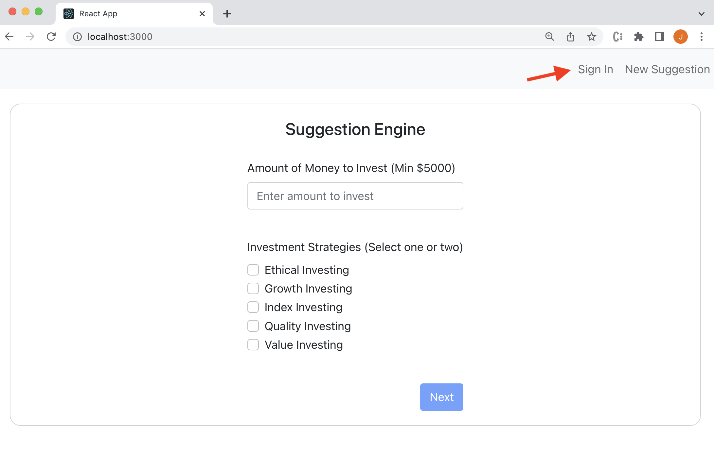
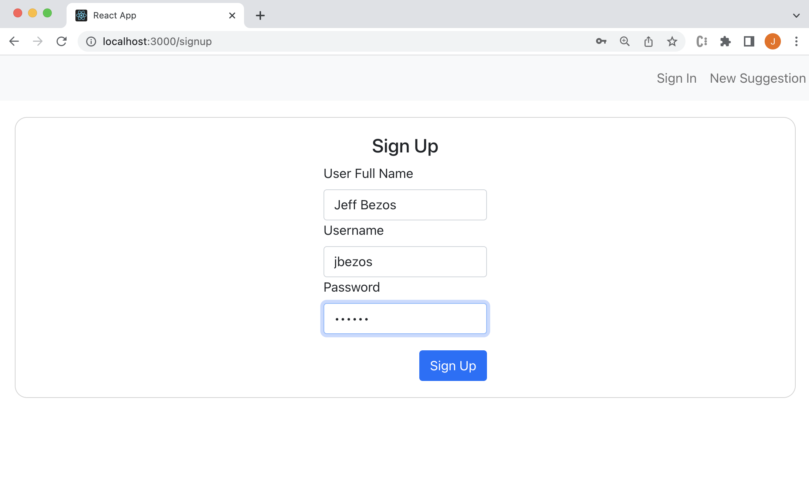
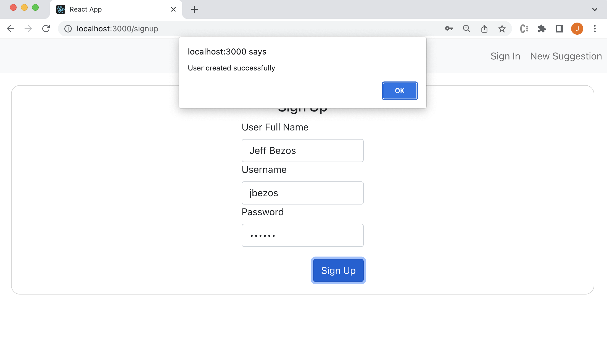
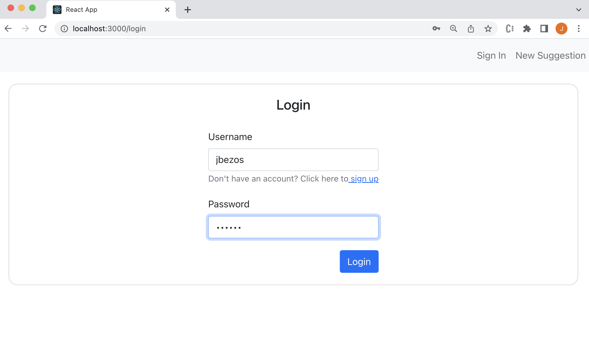

# Stock Portfolio Suggestion Engine

# Project Description

The project consists of creating a Stock Portfolio Suggestion Engine system, where a user can create an account and simulate a portfolio of stocks or ETFs according to a type of investment strategy, with the assets that performed best for that specific strategy for the last year. The user will also be able to monitor this wallet through the option to view the history of the last 5 days.

The project will be developed using the Python language with the Flask framework for the backend (APIs that provide business logic and data reads/writes) and Node JS for the frontend (external webapp that provides all UI functionality). To keep the information, the MySql database will be used, which will be hosted on AWS.

# Instructions for Testing

## Pre-requisites
* node v.16.14.2 to 18.x
* npm
* python 3.8.5 or higher

## Steps for Backend

### Install dependencies
```
$ cd backend
$ pip install -r requirements.txt
```

### Run the backend APIs
```
$ FLASK_APP=app.py FLASK_ENV=development flask run
```

Go to http://127.0.0.1:5000 and this should display the Swagger page with access to the APIs.

## Steps for Frontend

### Install dependencies
```
$ cd frontend
$ npm install
```

### Run the frontend application
```
$ npm start
```

This should launch the application on your browser at http://localhost:3000.

# Test Cases

1. Sign up / Login / Edit User

   * Click on the `Sign In` on the top-right.
   * Enter the new user's information.
   * Click on `Sign Up` and get confirmation of success.
   * Sign in as the newly created user.
  
<!-- 
Step 1: Click on the `Sign In` on the top-right.


Step 2: Enter the new user's information.


Step 3: Click on `Sign Up` and get confirmation of success.


Step 4: Sign in as the newly created user.

-->

2. Not signed in recommendations

This should be identical the below descriptions for getting recommendations, except that the generated results cannot be saved since it is a guest user.

Signed-In / 1 strategy:

3. Get recommendations
    * Go to "New Suggestion"
    * Input amount to invest 
    * Test with value less than $5000, error prompt should appear
    * Select 1 of 5 investment strategies
    * Press "Next" to obtain results for selected strategy and investment amount
    * In the next view, 4 Stocks/ETFs should be returned for the selected investment strategy.
    
4. Save recommendations
    * User must be signed in to save an investment 
    * From the results page, click "Save Investment"
    * Investment is saved within the backend/database
    * Confirmation alert should appear
    * After confirming, user should be redirected to view history
    
5. View Existing
    * User must be signed in to view existing suggestion
    * From the nav click "View Existing Suggestions"
    * Results should show saved investment when user selected one investment strategy and the amount invested
    
6. View History
    * User must be signed in to view history
    * History can be viewed after saving an investment or clicking "View History" from the nav
    * Graph will show previous 5 day results for all stock/etfs for selected investment strategy

Signed-In / 2 strategies:

7. Get recommendations
    * Go to "New Suggestion"
    * Input amount to invest 
    * Test with value less than $5000, error prompt should appear
    * Select 2 of 5 investment strategies
    * Press "Next" to obtain results for selected strategy and investment amount
    * In the next view, 4 Stocks/ETFs should be returned for each selected investment strategy. Value inputted should be distributed among 8 results. 2 sections should appear, one for each strategy selected.
    
8. Save recommendations
    * User must be signed in to save an investment 
    * From the results page, click "Save Investment"
    * Investment is saved within the backend/database
    * Confirmation alert should appear
    * After confirming, user should be redirected to view history
    
9. View Existing
    * User must be signed in to view existing suggestion
    * From the nav click "View Existing Suggestions"
    * Results should show saved investment when user selected two investment strategies and the amount invested
    
10. View History
    * User must be signed in to view history
    * History can be viewed after saving an investment or clicking "View History" from the nav
    * Graph will show previous 5 day results for all stock/etfs for selected investment strategies. For two strategies selected, two graphs will appear
    * Each graph will display results corresponding to selected investment strategy.

## Extras test case scenarios

1. View Existing with no data yet

After the user signs into the system as a new user, a menu will appear on the top right. The user will click on the "View Existing Suggestions" link, and he will be redirected to a new screen. As the user does not have any investment yet, the system will show an error message in a popup "The user doesn't have an active investment".

2. View History with no data yet

After the user signs into the system as a new user, a menu will appear on the top right. The user will click on the "View History" link, and he will be redirected to a new screen. As the user does not have any investment yet, the system will show an error message in a popup "The user doesn't have an active investment".

3. User tries to create user with same username

When creating a new account, click on the "Sign up" link. The user needs to fill in the name, username, and password fields. However, if the username exists in the database, the system will present an error message in a popup "Username already exits".
