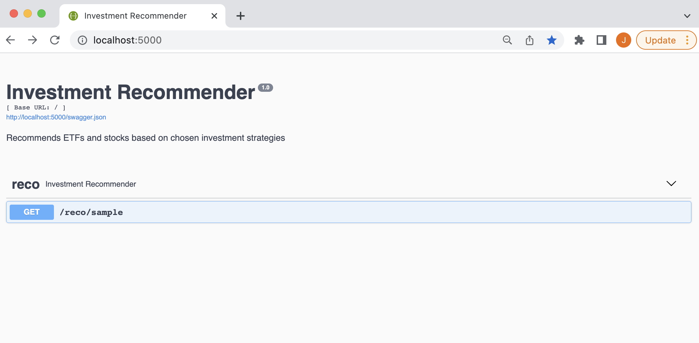
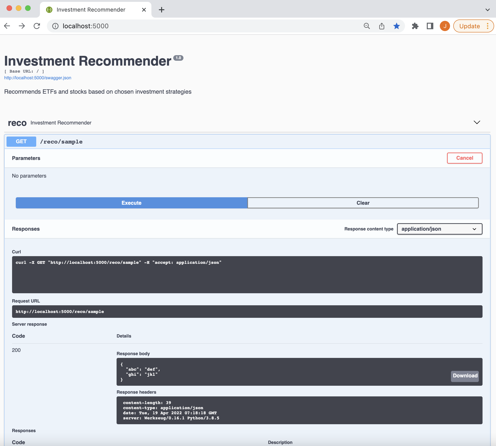

# CMPE-285: Team Project
* John Monsod : ID# 015234505
* Alex Hong : ID# 009556820
* Ganesh Nehru : ID# 009509747
* Rodrigo Colasso : ID# 015954146

# Project Description

This is the Python-based API layer that provides backend capabilities for the frontend UI.

# How to run

## Ensure all pre-requisite libraries are installed in your env:

`pip3 install -r requirements.txt` (or equivalent)

## I. To run:

`$ FLASK_APP=app.py flask run`

### To view the swagger APIs:

http://localhost:5000

It would look something like this:

To test the sample API, expand the `/reco/sample`, click on `Try it out` then `Execute`. It should look similar to the following:

